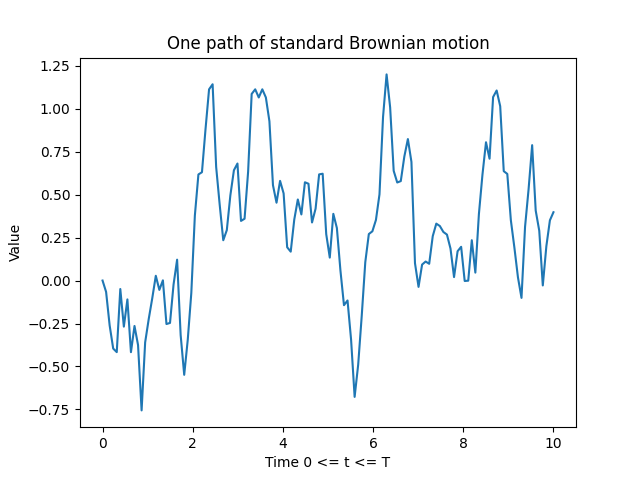
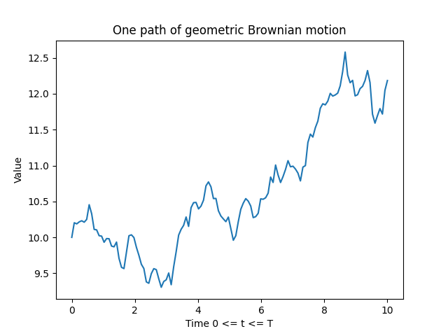
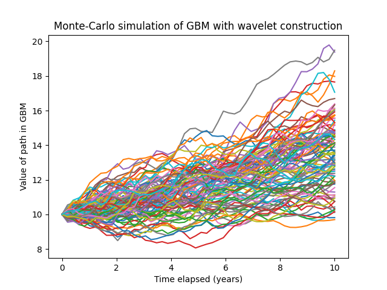
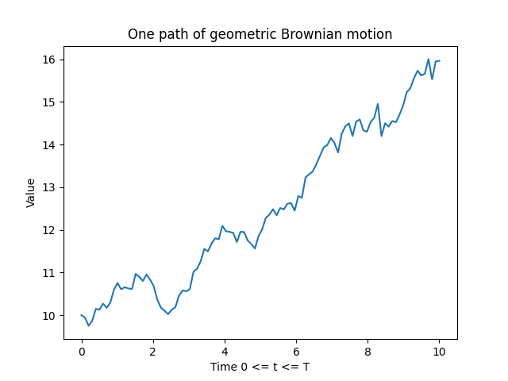
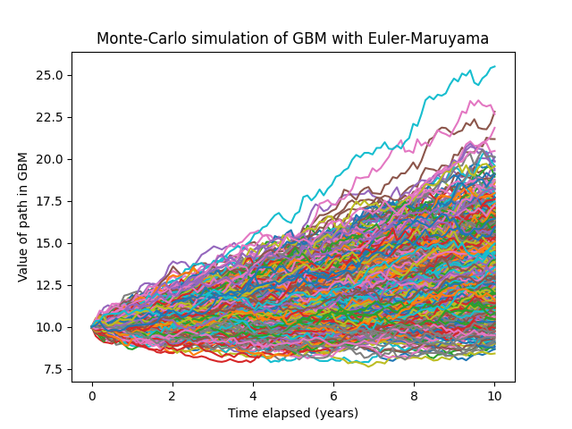

One path of standard Brownian motion



---

One path of geometric Brownian motion



---

```
Parameters used for Monte-Carlo simulations below:
initialStockPrice = 10
totalTime = 10
strikePrice = 12
riskFreeRate = 0.03
sigma = 0.05
numPoints = 50
callPrice = 1.5
numTrials = 1000
numSummands = 50

```
Monte‑Carlo simulation of GBM with wavelet construction (1000 trials)



```
The gain/loss from Black‑Scholes is -0.1926862567661427.
The gain/loss from the Monte‑Carlo simulation buying at callPrice is -0.16801284992930077.
The error between the Monte‑Carlo simulation with the wavelet construction and Black‑Scholes is 0.024673406836841938.
The error of the Monte‑Carlo simulation with the wavelet construction should converge in distribution to N(0.0, 0.0018316946276546895) by CLT.
```

---

Euler–Maruyama GBM sample path



---

Monte‑Carlo simulation of GBM with Euler–Maruyama (1000 trials)



```
The gain/loss from buying at the Black‑Scholes price is -0.1926862567661427.
The gain/loss from the Monte‑Carlo simulation buying at callPrice with the Euler‑Maruyama approach is -0.18910537675344674.
The error between the Monte‑Carlo simulation with the Euler‑Maruyama approach and Black‑Scholes is 0.003580880012695964.
The error of the Monte‑Carlo simulation with the Euler‑Maruyama approach should converge in distribution to N(0.0, 0.001992081724766438) by CLT.
```

